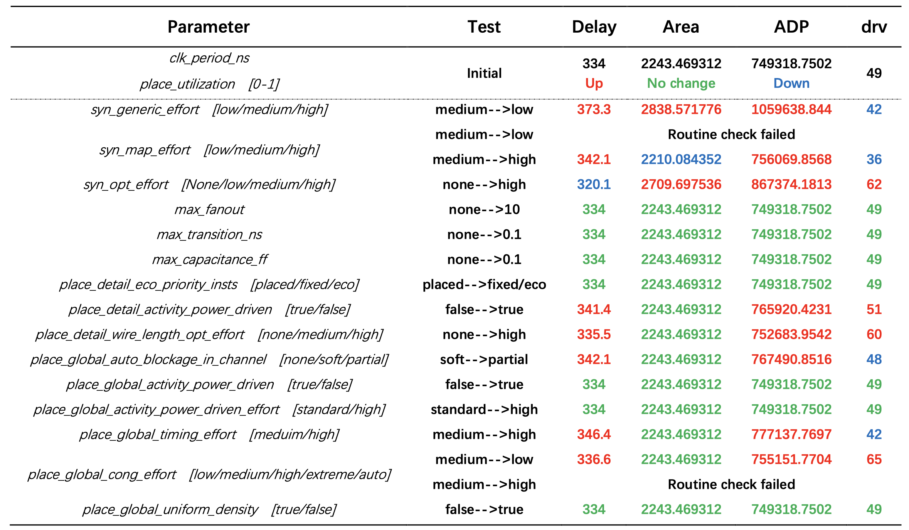
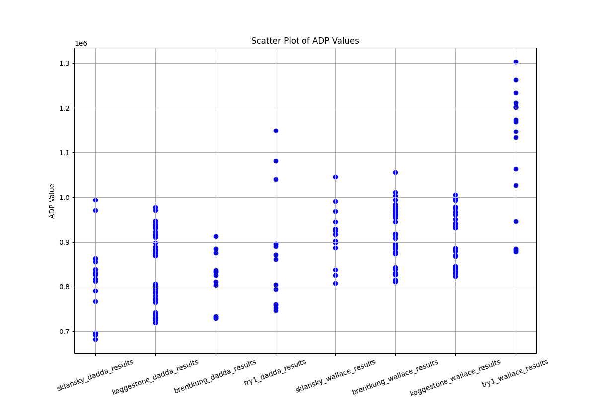

# EDA Lab3 实验报告

> 
李诗阳  陈维灿  秦雄昊

[toc]

## Baseline

在实验开始前，我们首先运行了基于随机取值（包括cpa、ct、tool）的仿真，运行了100次，从而获取总体分布的信息。

在100次运行中，有99次仿真成功并输出结果文件，1次仿真中途退出。仿真成功率为99%。

对于这99个仿真成功的case，我们分别对delay、area、drv、adp进行统计，结果如下表所示：

| Metric | Delay |  Area   | Drv  |   ADP   |
| :----: | :---: | :-----: | :--: | :-----: |
|  Min.  | 443.5 | 2687.4  |  0   | 1305833 |
|  Max.  | 932.1 | 13925.8 | 146  | 6500544 |
|  Avg.  | 678.0 | 5443.5  | 11.6 | 3475061 |

统计其中不包含物理违例的case（drv = 0），得到27个，通过率为27.3%。

对于这27个不包含物理违例的case，我们对adp进行统计，结果如下表所示：

| Min. ADP | Max. ADP | Avg. ADP |
| :------: | :------: | :------: |
| 2032144  | 4988346  | 3441826  |

对以上99个案例绘制Area-Delay散点图，其中红色代表存在物理违例，蓝色代表不存在物理违例：

在后续评估中，我们对于允许违例的情况，将选择**3475601**作为ADP的Baseline；对于不允许违例的情况，将选择**3441826**作为ADP的Baseline。

## CPA设计

首先对cpa进行设计。

考虑到对于在乘法器的输入中，两端的数据先抵达，中间的数据在一定延时后抵达。因此可以在Sklansky加法器的基础上进行变动：

> 考虑16bit的加法器设计，
>
> 对于[7:0]的数据，从0开始依次往后计算；
>
> 对于[15:8]的数据，从15开始依次往前计算。

在这样的设计下，中间的数据需要用到的时间被延后，从而填补了时间的间隙，有利于pipeline的进行，从而降低延时。

具体代码实现如下：

~~~python
def get_Try1_adder(input_bit: int) -> PPAdderConfig:
    node_mat = np.zeros((input_bit, input_bit))
    for m in range(input_bit):
        node_mat[m, m] = 1
        node_mat[m, 0] = 1
    for m in range(input_bit // 2, input_bit):
        for n in range(input_bit // 2, m):
            node_mat[m, n] = 1
    return PPAdderConfig(input_bit, required_mat=node_mat)
~~~

## 手动调节优化

在得到cpa的设计后，我们尝试去检验Try1的优势，因此，在None Seed的情况下，执行了cpa和ct的不同组合，结果如下：

| cpa/ct set |  Sklansky   | Koggestone | Brentkung |
| :--------: | :---------: | :--------: | :-------: |
|  Wallace   |   2695615   |  2989925   |  2944949  |
|   Dadda    | **2607058** |  2463629   |  2614895  |

对比发现，Dadda是比Wallace更优的ct设计。

因此，我们组合Dadda和Try1进行仿真，在None Seed情况下得到了`ADP=2456811.399168`，这是目前在工具None Seed情况下的最优解。

进一步，我们调整工具的参数，首先将`place_utilization`项从0.5调整至0.7，打开随机Seed，搜索10次仿真后得到了违例情况下`ADP=1203994.5463295998`，发现，这已经小于Baseline中的Min. ADP(1305833)。

更进一步，我们将`place_utilization`项从0.7调整至0.9，搜索20次仿真后，得到了违例情况下的`ADP=910561.6166`以及无违例情况下的`ADP=919237.6627`。

而当`place_utilization`项从0.9调整至0.98后，我们依然得到了无违例情况，当前最优解为`ADP=876462.3616`。

随后，我们还调整了`clk_period`,从0.5降到0.2后，搜索20次，没有得到无违例的case，但得到了违例情况下当前的最优解：`ADP=755185.8231`

对比Baseline，在此轮手动调节优化后，我们得到了显著的提升：

> 允许违例：
>
> Base:   ADP=3475601
>
> Opt:   ADP=755185	**(21.7%Base  shows  4.60X reduction)**
>
> 不允许违例：
>
> Base:   ADP=3441826
>
> Opt:   ADP=876462	**(25.5%Base  shows  3.92X reduction)**

下附在手动调节优化过程中，我们最终得到的18组结果：

~~~bash
Dir: 001 with ADP: 4429775.547648 // All random 1
Dir: 002 with ADP: 3312383.1552 // All random 2
Dir: 003 with ADP: 2695614.9325056 // None Seed: sklansky_wallace
Dir: 004 with ADP: 2695614.9325056 // None Seed: sklansk_wallace (Check)
Dir: 005 with ADP: 2607057.8030592 // None Seed: sklansky_dadda
Dir: 006 with ADP: 2989924.897536 // None Seed: koggestone_wallace
Dir: 007 with ADP: 2463628.898304 // None Seed: koggestone_dadda
Dir: 008 with ADP: 2944948.6089215996 // None Seed: brentkung_wallace
Dir: 009 with ADP: 2614895.364096 // None Seed: brentkung_dadda
Dir: 010 with ADP: 2456811.399168 // None Seed: try1_dadda
Dir: 011 with ADP: 1203994.5463295998 // uti from 0.5 to 0.7
Dir: 012 with ADP: 919237.6627 // uti from 0.7 to 0.9 (drv=0)
Dir: 013 with ADP: 919237.6627 // same with 12 in another parameter set
Dir: 014 with ADP: 910561.6166 // uti 0.9 optimal with drv
Dir: 015 with ADP: 876462.3616 // uti from 0.9 to 0.98 (drv=0)
Dir: 016 with ADP: 863414.7126 // clk from 0.5 to 0.2
Dir: 017 with ADP: 863414.7126 // same with 16 in another parameter set
Dir: 018 with ADP: 755185.8231 // clk 0.2 optimal with drv
~~~

## 对Tool进行搜索

为了理解Tool各项参数对于结果的影响，我们对参数进行了逐项测试，控制其他参数不变，测试单一参数对ADP、drv等的影响，仿真结果如下表所示：

从逐项测试结果中可以看出，除了影响最大的`clk_period`以及`place_utilization`，在小时钟、高面积利用率的情况下，各项参数对delay和area产生了各有优劣的影响，单一参数对ADP的影响范围在3365.203968至310320.0938，即0.45%至41.4%。因此不考虑违例时，可以通过调整其余参数组合，进一步优化ADP结果。除此之外，其他参数对结果的另一重要影响是对物理违例的优化，在固定的时延下，调整面积利用率产生的物理违例数量即drv是不同的，因此可以通过调整其他参数，达到drv=0时最大的面积利用率，从而最大程度优化ADP。

在前述探索过程中，我们发现核心影响的两个Tool参数`clk=0.2,uti=0.98`在这组配置下可以得到违例情况下的最优解。因此，本轮实验设定这一组参数，对其他参数进行随机搜索，遍历8种cpa和ct的组合，一共仿真通过223组结果，汇总如下图所示：

从图中可以发现，dadda比wallace更容易得到较低的adp。

最优的几个case来自于sklansky+dadda的组合。展示前10个adp的最优解如下：

~~~bash
ADP:      682161.8550    Source: sklansky_dadda_results    in  Dir: af146af0298a8c6ba8bc803c2ca40fff6b17b6f4b320dbef4b4dfdd835f07461        
ADP:      692208.1567    Source: sklansky_dadda_results    in  Dir: 6c48a3e61f5db74398f2d265de9a32ad295be6536c0bff52d141790a087cac80        
ADP:      692278.8187    Source: sklansky_dadda_results    in  Dir: e42190cd39bd75b962bc6f066e2d98288e0def7c0b3c9be0c99630c9d056dffa        
ADP:      693442.3427    Source: sklansky_dadda_results    in  Dir: 694d09033ab243e39177c7d60804e3cf1b3c891d73c00cc23bb0448deaa29d7c        
ADP:      693901.3755    Source: sklansky_dadda_results    in  Dir: dbe070d59b4026564a60b91b774675e879050e2ac7a6666058af428ff749ce83        
ADP:      696466.7505    Source: sklansky_dadda_results    in  Dir: 785508a082a2827b38f43b76307bfd9a939c25119ef4d87c17e8a1443de79192        
ADP:      697245.4785    Source: sklansky_dadda_results    in  Dir: e9f6d175779e8ed7fa92be675adb15104f46aee504eb1ac494e33f54a20d4afa        
ADP:      720171.6770    Source: koggestone_dadda_results    in  Dir: cd0e867fdae1c2006a7c9ee006d70acf0a2c58e6a94ee5d465f56affe4f06e6d        
ADP:      725507.9290    Source: koggestone_dadda_results    in  Dir: 8f92eeed4cb880cd0f0e839d00942049faa90d2d54882b6ac8fbb035adc8d0a5        
ADP:      725507.9290    Source: koggestone_dadda_results    in  Dir: f7fef9d999d9c2f697ee9c64f993f1016506e5252796d8ca52aec0652349d780        
~~~

因此，对比Baseline，在此轮搜索优化后，我们在允许违例的情况下得到了显著的提升：

> 允许违例：
>
> Base:   ADP=3475601
>
> Opt:   ADP=682162	**(19.6%Base  shows  5.10X reduction)**
